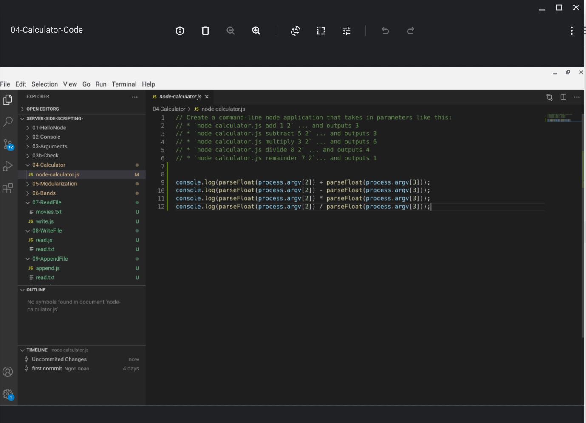
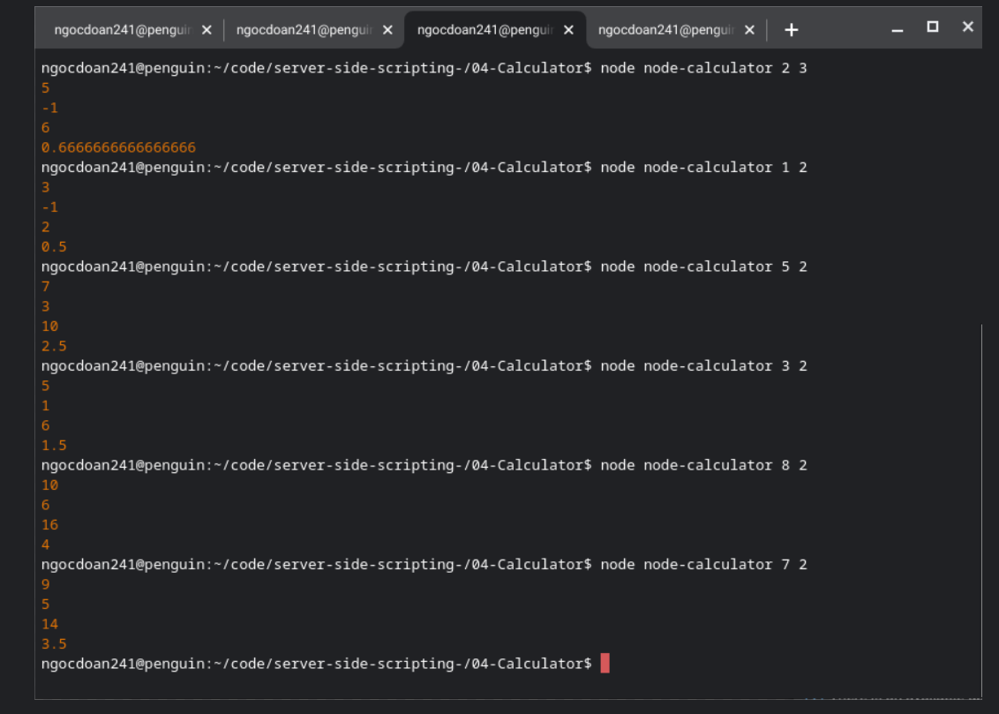
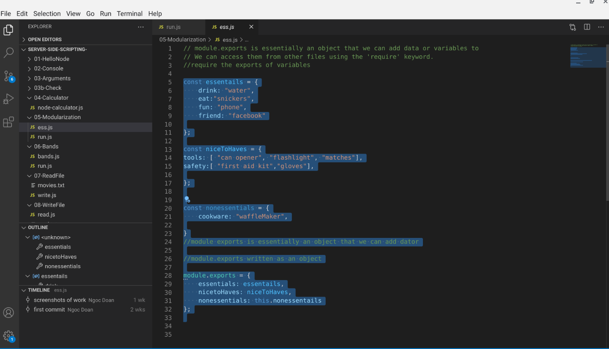
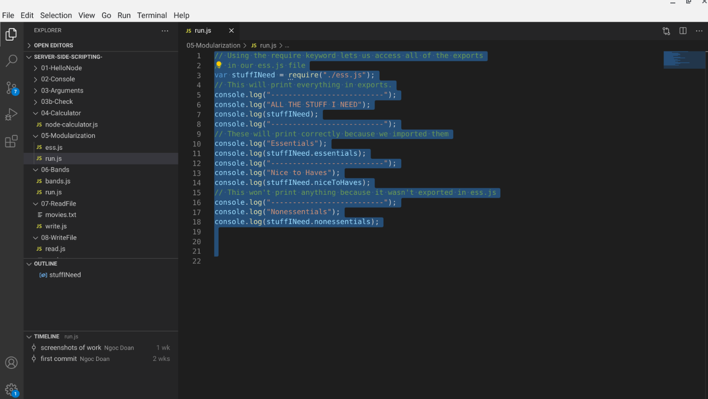
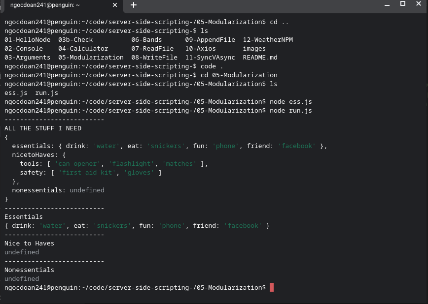
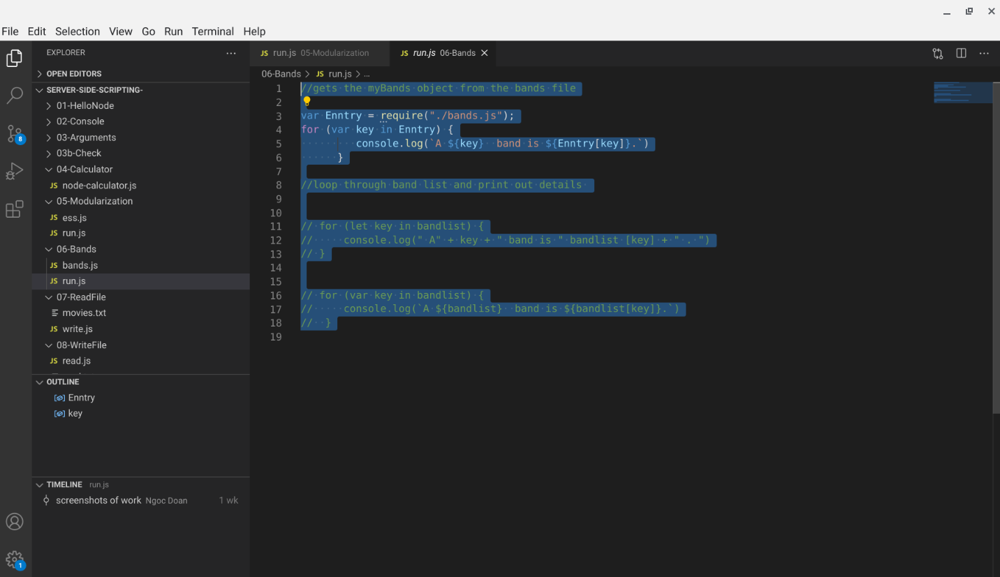
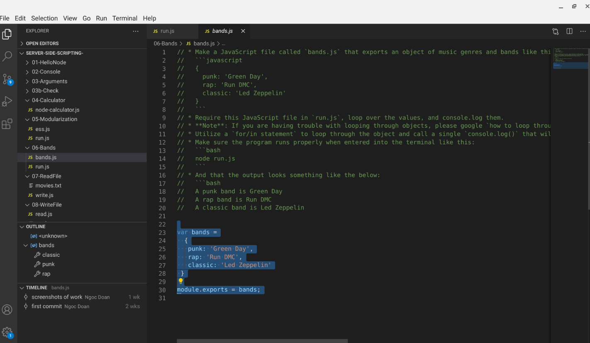
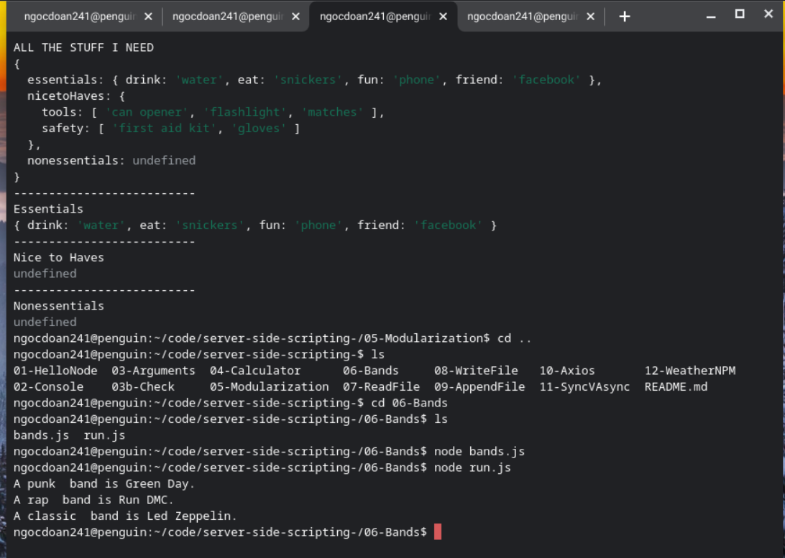

# Server-Side-Scripting 

##**Overview**:
 

## **Developer**: Ngoc Doan
## **Place:** *Denver, CO*
## **Institute: Emily Griffith Technical College
## **Title**: Node Beginner Overview  
## **Date: February 18, 2021

## **Goal**:
To show understanding of introduction to node.js 

## **Target Market**: 
Screenshots of Proof of learning

 

 

 

## **Technologies to be used:**:
* JavaScript
* Node

